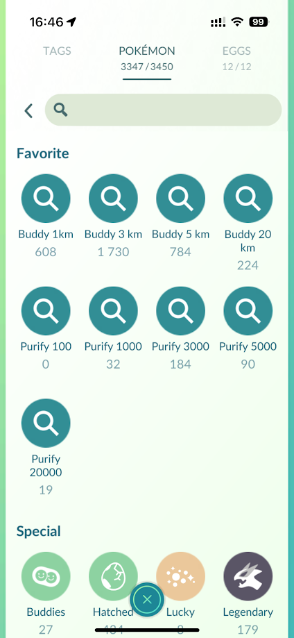

# Pokemon GO search strings
This project reads the game master file and generates search strings for Pokemon GO. The search strings can be used to filter Pokemon using the in the game search.
## Usage
Copy the search string and paste it in the search bar in Pokemon GO.

To save a search string:
 1. Clear the search string from the search bar
 1. [See more] to reveal Recent searches
 1. Long press on the search string under Recent to add it to favorites
 1. Long press on the search string under Favorites and give the search a name


## BuddyDistance
| Name | Search string |
|------|---------------|
| `Buddy 1 km` | `10-22,25-26,35-36,39-42,74-76,129-130,161-169,172-174,218-219,223-224,261-269,276-277,283-284,293-295,304-306,316-317,320-321,325-326,333-334,339-340,396-402,412-414,420-421,504-510,519-521,527-528,540-550,556-558,587,602-604,659-666,731-738,742-743,746,759-760,767-768,819-828,835-836,915-920,924-925,938-941` |
| `Buddy 3 km` | `1-9,23-24,27-34,37-38,43-73,77-94,96-105,108-112,114-121,128,132,137,152-160,170-171,175-178,182-184,186-195,198-200,202-203,206,209-211,213-217,220-222,228-235,252-260,270-275,278-279,285-286,296-301,307-315,318-319,322-324,327,331-332,335-338,341-348,353-356,360-368,370,387-395,406-407,415-416,418-419,422-424,427-432,434-437,449-450,453-454,456-457,459-465,468-469,473-474,476-478,495-503,511-518,522-526,529-531,535-537,554-555,559-560,562-563,568-569,572-586,588-593,595-598,605-606,613-614,616-617,619-620,626,631-632,650-658,667-675,677-678,682-695,702,707,712-713,722-730,739-741,747-758,761-766,769-771,774-775,777,779,810-818,829-834,837-839,843-847,852-855,862-865,867-869,876-877,901,906-914,921-923,926-931,942-945,948-952,955-961,965-967,969-976,979-982` |
| `Buddy 5 km` | `95,106-107,113,122-127,131,133-136,138-143,147-149,179-181,185,196-197,201,204-205,207-208,212,225-227,236-242,246-248,280-282,287-292,302-303,328-330,349-352,357-359,369,371-376,403-405,408-411,417,425-426,433,438-448,451-452,455,458,466-467,470-472,475,479,532-534,538-539,551-553,561,564-567,570-571,594,599-601,607-612,615,618,621-625,627-630,633-637,676,679-681,696-701,703-706,708-711,714-715,744-745,776,778,780-784,840-842,848-851,856-861,866,870-875,878-887,899-900,903-904,932-937,946-947,953-954,962-964,968,977-978,983,996-1000` |
| `Buddy 20 km` | `144-146,150-151,243-245,249-251,377-386,480-494,638-649,716-721,772-773,785-809,888-898,905,984-995,1001-1008` |
## PurificationStardustNeeded
| Name | Search string |
|------|---------------|
| `Purify 100` | `shadow&718` |
| `Purify 1000` | `shadow&13-15,19-20,41-42,74-76,129-130,165-166,169,261-262,293-295,304-306,320-321,325-326,339-340,396-400,504-505,509-510,519-521,557-558,580-581,590-591` |
| `Purify 3000` | `shadow&1-9,23-24,27-34,37-38,43-45,48-55,58-73,77-83,88-94,96-105,109-112,114-117,122,137,152-160,177-178,182,186-190,194-195,198-200,202-203,209-210,213,215-217,220-221,228-234,252-260,263-264,273-275,296-297,299,309-310,318-319,322-323,331-332,341-342,345-348,353-356,361-365,387-395,424,429-432,434-435,449-450,453-454,459-462,464-465,473-474,476-478,522-523,529-530,554,562-563,595-598,618,862-867,901,903` |
| `Purify 5000` | `shadow&95,106-107,123,125-127,131,138-143,147-149,179-181,185,204-205,207-208,212,225,227,237,246-250,280-282,302-303,328-330,349-350,359,371-376,403-405,408-411,425-426,443-445,451-452,466-467,472,475,538-539,607-609,622-623` |
| `Purify 20000` | `shadow&144-146,150,243-245,249-250,377-382,486` |
# Regenerating the README.md file
To regenerate the README.md file, run the `SearchStringGenerator` project.
```
dotnet run --project SearchStringGenerator/SearchStringGenerator.csproj
```
